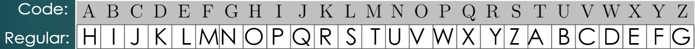
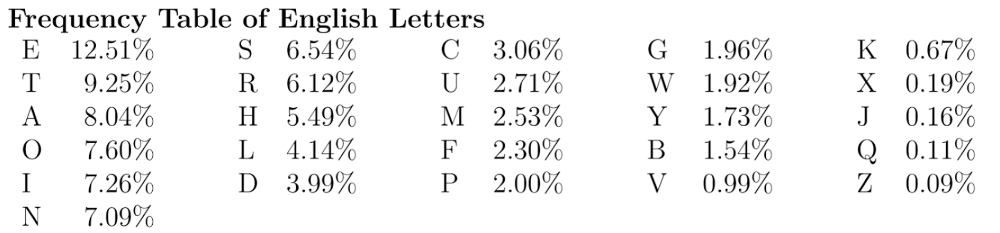
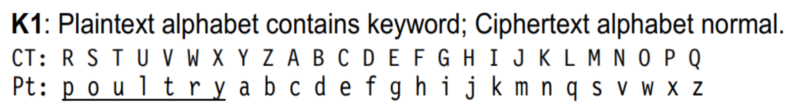
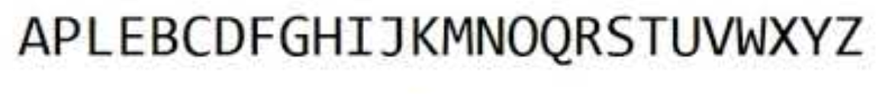
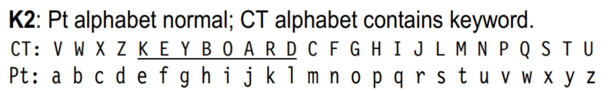
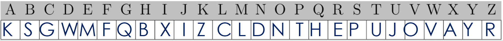
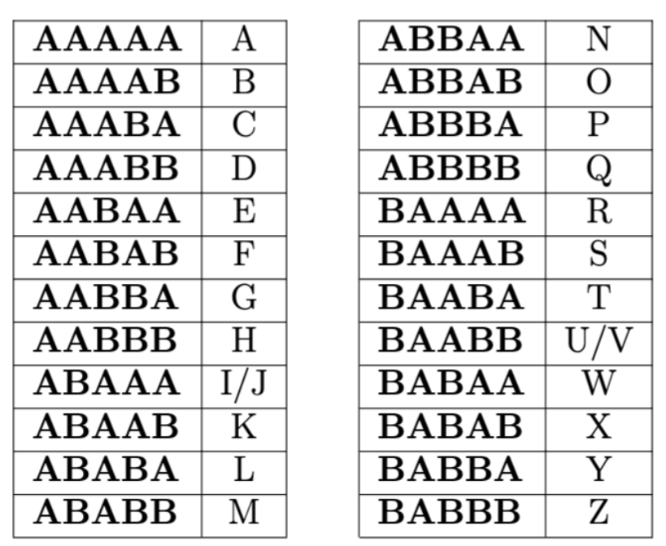
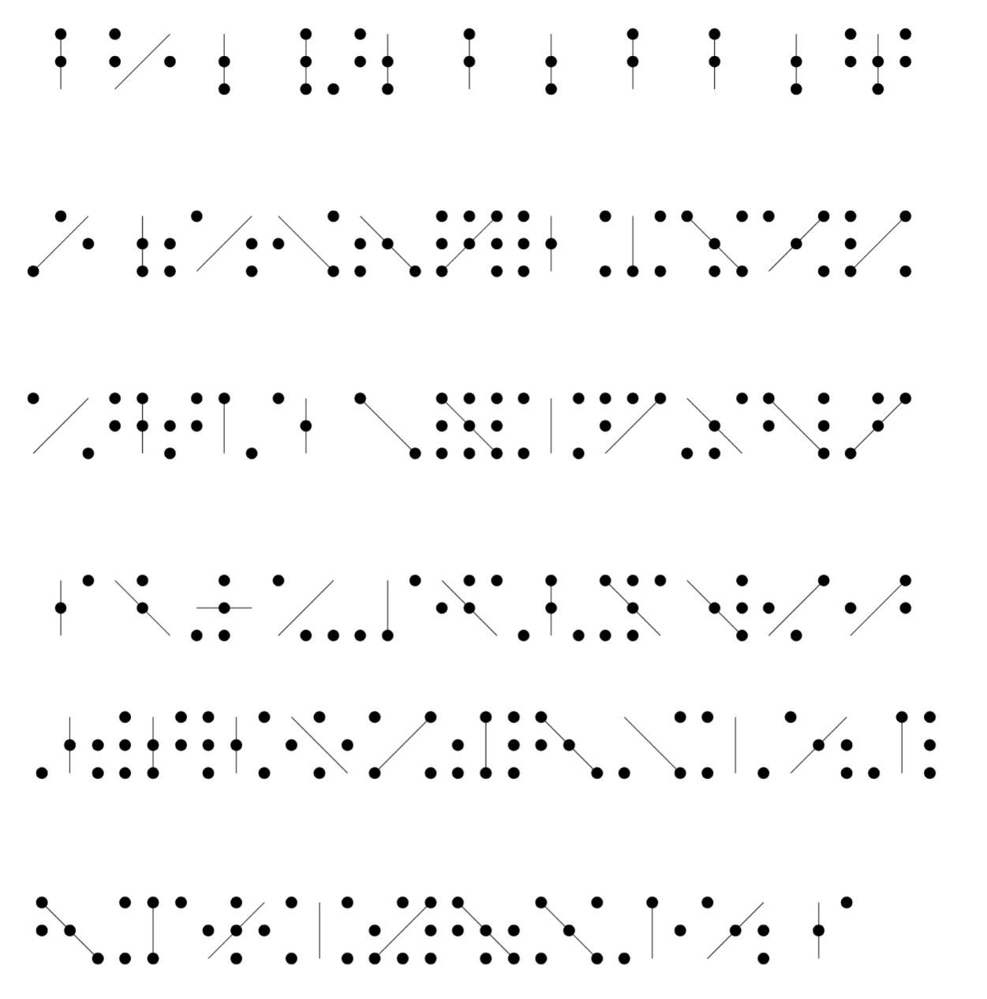
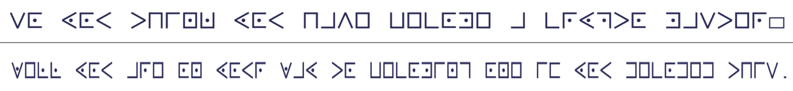

# W3lc0m3 t0 Day 1 of Crypt0 W33k!!

Today we will be learning about the first ciphers that were used in the old days.  
Specifically, we will be learning about the Caesar Cipher, the Substitution Cipher, the Baconian Cipher, and the Pig Pen Cipher.  

## Daily Puzzle

While we're waiting to start, solve this crossword puzzle with words that you will understand by the end of the day. There is a word bank below the crossword puzzle.

    <iframe border="0" src="https://crosswordlabs.com/embed/cryptography-crossword-puzzle?clue_height=30" style="flex:1; width:100%; padding:5px 0px 0 5px; border:3px solid black; "></iframe>
    <a target="_blank" style="align-self:center; font-size:12px; color:black; padding-top:10px; text-decoration:none;text-align:center" href="https://crosswordlabs.com">This puzzle was made using https://crosswordlabs.com.</a>

### Word Bank

ENCODE  |  DECODE  |  SUBSTITUTION  |  CAESAR  |  BACONIAN  |  CYBERCHEF

DATA PROTECTION  |  PLAINTEXT  |  CIPHER  |  CRYPTOGRAPHY  |  CYBERSECURITY  |  PIGPEN

## Let's Get Cracking...

Today we will be learning some of the first ciphers ever used (cipher is another word for a secret code). We will learn how to solve the Caesar Cipher, the Substitution Cipher, the Baconian Cipher, and the Pig Pen Cipher.

## The Caesar Cipher

The **Caesar Cipher** was invented by Julius Caesar to protect military secrets of the Roman Empire. 
It was one of the first ciphers ever invented!  

### Caesar Wheel

Before starting to learn about the Caesar Cipher, take some time to print and assemble [Caesar Cipher wheel](https://fprint.net/wp-content/uploads/printable-cipher-wheel.pdf).  
In order to assemble your wheel, follow these steps:  
- Cut out the two wheels from the pdf. 
- *Carefully* poke a hole through the dot in the centre of each wheel.
- Place the smaller circle over the larger circle so that the holes line up, and join them
together using a paperclip.
- The two circles should be able to rotate around this centre hole with respect to each
other.

### What is the Caesar Cipher?

- Essentially a shift
- Plaintext(Regular) alphabet and Cipher(Code) alphabet in alphabetical order
- We'll try an example with a 19 letter shift
- Pull out your wheels! We're ging to try an example.

- Line up the letter "A" on the inside circle (this represents your plain text alphabet) with the letter "T" on the outside circle (this represents your cipher alphabet.

Now, we have to figure out how to use this key. Let's try and decode this Caesar Cipher. The answer will be my favorite place to visit.

**MAX UXTVA**

Start by finding the first letter of the code, "M", on your big circle. Then, write down the letter on the small circle that is lined up with the "M" on your outside circle. To give you a hint, the first letter should be a "T". Now, all you have to do is keep repeating this for each letter of the message and then you will know my favorite place to visit. 

Now, you can try to crack this code on your own. The answer should be a type of cereal.

**VBGGTFHG MHTLM VKNGVA**

Feel free to take a break here and practice writing your own codes using your wheel. You can practice writing your name, your school, your favorite ice cream flavor, or anything you want. If you're eager, try to teach a sibling, parent, or friend how to use your wheel to crack Caesar Ciphers and practice writing secret messages to each other!

### How Do You Solve a Caesar Cipher?

In order to use your Caesar wheel to crack codes, you need to know the size of the shift. Most of the time, you don't know the size of the shift. No worries, we can still solve these codes it just takes a little more thinking. Here are some helpful hints on how to crack Caesar Ciphers.  
- Look for a hint, like...
  - Single letter words (I & A)
  - Likely words you have most of the letters for
  - 2 letter words (in, on, no, of, so, to, etc.)
  - Name or place that you know is in the cipher
- Utilize letter frequency

Remember, once you have 1 letter figured out, you can line it up on your wheel and you now have a key to decipher the whole code.

### Practice!

Now that you've learned about Caesar Ciphers and how to decode them, head to [this link](https://learnification.fun/) for more practice.
Log in using any google account you or your parents have. 
Then click on the menu button in the top left corner, and click on bathroom ciphers. 
This will take you through a few examples of Caesar Ciphers, but once you get to a problem that asks about a different type of cipher, come back here to learn how to solve it.

## The Substitution Cipher

The Substitution Cipher is very similar to the Caesar Cipher, there are just a few slight differences.  
In a Substitution Cipher, each letter in the plaintext alphabet is substituted for a different letter in the cipher alphabet. 
Caesar Ciphers substitute letters in a very specific way, via a shift. 
However, the Substitution Ciphers utilize more complicated methods for substituting letters, based on the type of alphabet.
We are going to focus on the Aristocrat cipher here.

### What is an Aristocrat Cipher?

- Is the most basic type of substitution cipher
- Looks like the Caesar Cipher
- Depends on the alphabet used

There are 5 different types of alphabets used with Aristocrats

- K1
- K2
- K3
- K4
- Random

We will focus here on the K1, K2, and random.

### What is the K1 Alphabet?

- All about the plaintext (regular) alphabet
- Plaintext alphabet begins with a keyword, followed by the rest of the letters in alphabetical order
- Repeated letters are skipped
- Example – *POULTRY* and *APPLE* as keyword

### What is the K2 Alphabet?

- All about the cipher alphabet
- Cipher alphabet contains a keyword, followed by the remaining letters in alphabetical order
- Sometimes includes a shift
- Repeated letters are skipped
- Example – *KEYBOARD* as keyword

### What is the Random Alphabet?

- Exactly what it sounds like.
- The letters are all scrambled randomly, with no sort of order.
- Here's an example

### How Do You Solve an Aristocrat Cipher?

Solving an Aristocrat Cipher is very similar to solving a Caesar Cipher, here are some tips:  
- Look for a hint 
- Likely word
- Name or place
- Single letter words (I & A)
- Fill in letters and words as they come
- If possible, try and figure out what the keyword is so that you can figure out the alphabet
- When in doubt -- letter frequency!

### Practice!

Now that you've learned about the Aristocrat Cipher and how to decode it, head to [this link](https://learnification.fun/module/crypto/USETHISBATHROOMANYWAYANDTEXTYOURFRIENDFORHELP) for more practice.
If it asks you to log in, log in using any google account you or your parents have. 
Then you will be presented with some example Aristocrat Ciphers. 
This site has examples of Aristocrats using all 5 alphabets, so pay attention to the question. 
You can research the K3 and K4 alphabets when you get to them, or you can try and solve these ciphers using the same skills as solving a cipher with a K1 or K2 alphabet.

### If you're interested in learning more about the Ceasar and Substitution Ciphers...

You can research the last 2 alphabets that we didn't cover (K3 and K4).  
You can also use [this Aristocrat generator](https://codepen.io/AndyNovo/full/KKpNRxw) created by our awesome professor Dr. Andy Novocin to practice an unlimited amount of Aristocrat Ciphers.  
If your school has a Science Olympiad team, consider joining it and competing in the CodeBusters event. This event is all about cracking ciphers!

## Switching Gears: Baconian Cipher

Now that we've learned about the Ceasar and Substitution Ciphers, lets check out a new cipher called the Baconian Cipher. This cipher is quite different from the Caesar Cipher, but it is another one of the original ciphers. Baconian may sound like one of your favorite breakfast foods, but it's actually named after it's founder, Sir Francis Bacon, who created the Baconian Cipher is 1605.

### What is the Baconian Cipher and How Does it Work?

- It is based on 5 bit binary encoding (this means 5 digit strings made up of 2 symbols represent each letter)
- Traditionally, the 5 bit encoding is strings of "A"'s and "B"'s
- There are 2 versions of the Baconian alphabet
  - We will use the version where I/J have the same encoding and U/V have the same encoding
 - Here is the Baconian alphabet
 
 
 
- In the encoded message, there are two typefaces or different symbols that each represent an “A” or a “B”
- Replace the typeface with the respective letter it represents (A or B)
- Use the alphabet of the Baconian cipher to determine the plaintext letter

### Let's Try an Example

Here is the coded messade you have to decode:

**LEt uS StaRt WitH aN EAsy PrOBLEm fIrST. FUn!**

Look closely at this message and see if you can identify the 2 typefaces.  
You will see that some letters are capitalized, while some letters are lowercase.  
Now you have a choice to make. You can either choose to have lowercase letters represent A and capital letters represent B, or you can choose the opposite where capital letters represent A and lowercase letters represent B.  
Only one of these options is correct, and the other option will give you a random string of letters.  
The only way to find out which method is correct is to test it!  
Rewrite the message in "A"'s and "B"'s based on whichever choice you made.  
Then, split the message into groups of 5 letters. Each group of 5 "A"'s and "B"'s represents 1 plaintext letter.  
Now use the Baconian alphabet to decode the message! If the decoded message doesn't make sense, try switching which kind of letter represents an "A" and which kind of letter represents a "B".

 
 
 ### Another Example, With a Twist
 
This cipher seems easy enough when the typefaces are clear. However, sometimes you have more than 2 options to choose from that could represent your "A"'s and "B"'s. To show this, try this example:

**NO** G**oOD** d**E**e**D g**O**Es u**n**Pu**N**IsH**e**d.**

Remeber in this example, you can choose between lowercase/capital letters or bolded/unbolded letters.

### Practice!

Now that you've learned about the Baconian Cipher and how to decode it, head to [this link](https://learnification.fun/module/crypto/TRYTOFINDANOTHERBATHROOMTHATHASTOILETPAPER) for more practice.
If it asks you to log in, log in using any google account you or your parents have. 
Then you will be presented with some example Baconian Ciphers.  
If you really love the Baconian Cipher, you can try to solve this one. It's very tough to solve since there are so many possibilities for A and B.

## Last Cipher of the Day: Pig Pen Cipher!

The Pig Pen Cipher is less formal than the previous ciphers, but it is a lot of fun! 

### What is the Pig Pen Cipher?

For the Pig Pen Cipher, each letter of the alphabet is assigned to a symbol based on this chart...

...which can be interpreted in this way

All you have to do is match the symbols with the corresponding letters!

### Example Time!

Try to solve this Pig Pen cipher using the Pig Pen alphabet.

## End of Day Wrap Up

Congratulations! You made it through day 1!!  
We hope you had fun learning about the different ciphers today.  
If you really liked today's lesson, be sure to check out the extra resources mentioned with each type of cipher.  
Take what you learned today and go teach a friend or a family member, and you can start sending secret messages to each other!  
See you tomorrow for a new lesson on the different number systems in cryptography.  
The next lesson will use [this link](https://udel.codes/crypto2).  
Or you can head back to our [home page for Crypto Week](https://udel.codes/crypto2).
