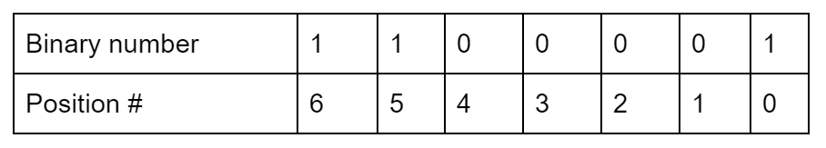
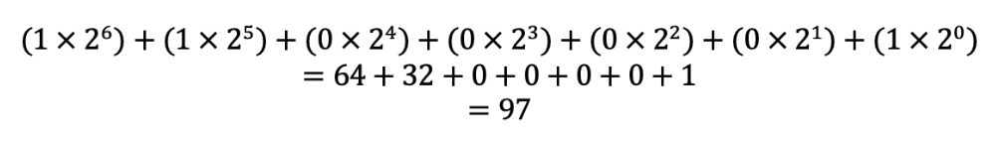
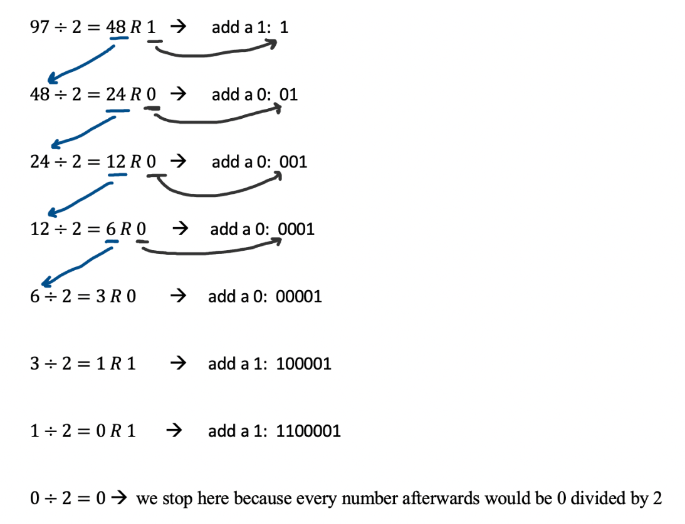

## W3lc0m3 t0 Day 2 of Crypt0 W33k!!

Today we will be learning about the different number systems that are used in coding and cybersecurity.  
Specifically, we will be learning about Binary, Base 10, and Hexadecimal.

### First Up, Mini Math Review!

We know, we know. We promised to teach you about cryptography, not math, 
but we *promise* that math is an integral part to cryptography.  

In cryptography, cybersecurity, and generally in coding, it is important to understand exponents.

#### What Are Exponents?

- They tell how many times a number should be multiplied by itself
- For example... 
  - 21 = 2
  - 22 = 2 x 2 = 4
  - 23 = 2 x 2 x 2 = 8
  - 33 = 3 x 3 x 3 = 27
  - 52 = 5 x 5 = 25
  - **20 = 1,  30 = 1,  40 = 1,  50 = 1**
  - **Any number raised to the 0th power is one.**
  - If you want to know why, check out what the multiplicative identity is

#### Pro Tip About Counting

In programming, counting often starts at 0 instead of 1.  
If you're counting left to right, the “**c**” in **computers** is in the 0th position. The “**o**” is in the 1st position, the “**m**” is in the 2nd position, and so on.

### We Need Your Help!

The FBI intercepted a secret message sent through E Corp.  
E Corp is an evil business franchise run by Ivan Vladimir and Dmitry Oleg.  
They are infamous for trying to steal money from the US government!  
The FBI needs ***YOUR*** help to interpret these secret messages and stop E Corp's evil plan!  

In the first message, Ivan Vladimir and Dmitry Oleg are plotting how much money they are planning to steal. We intercepted it but we don’t know how much they said. 

*Ivan Vladimir: “Dmitry Oleg”  
Dmitry Oleg: “Dr Vladimir”   
Ivan Vladimir: “Please comrade, call me Dr. V”  
“How much are we planning to steal from these Americanos?”  
Dmitry Oleg: “11010 trillion dollars”

Oh no! We already have 25 trillion dollars in debt!

First, we need to figure out what the 1s and 0s even mean.  
The FBI thinks they may be written in Binary, let's investigate.

## Binary to Base 10, the Basics

What is the Binary Number System?
- The binary number system is made up of only 0s and 1s.
- The prefix in binary is “bi” which means **two**. Binary code is only made up of **two** numbers.
- Another name for the binary system is base 2

What is the Base 10 Number System?
- The base 10 number system is what we use everyday!
- It is also known as the decimal system
- Base **10** uses **10** digits: 0,1,2,3,4,5,6,7,8,9

### How Do You Go From Binary to Base 10?

Let’s say that you have this binary number: 1100001  
How do we get it to base 10?  
First, you have to understand that each binary number is multiplied by 2 to the power of the position of the binary number (2Position of binary number)

For example...

Then, in order to convert to base 10, it would look like this:

So the binary number **1100001** is the number **97** in base 10!

Now that we reviewed how to convert from Binary to Base 10, let's go back to helping the FBI stop E Corp!  
In their message, E Corp said they were planning on stealing 11010 trillion dollars.  
How much money are they planning on stealing in Base 10?

### How Do You Go From Base 10 to Binary?

Now, how do we do the opposite and convert from base 10 to binary?

We have to divide our base 10 number repeatedly by two. 
The remainder tells us whether the binary number should be a 1 or a 0. 

Let’s start with our number we got before: 97.

First, divide 97 by 2.  
When we do that, we get 48 with a remainder of 1. 
The remainder (1) will become a part of our binary number while the quotient (48) will be divided by 2. 
This process repeats itself until the quotient becomes 0.

So the base 10 number **97** is the binary number **1100001**!

Here is a [reference](https://www.cs.odu.edu/~jbollen/cgi-bin/bin2dec.cgi?bin=1100001) for Binary and Base 10 if you need more practice or if you're just curious to learn more.

### Let's Communicate Like Dr. V Did!

You will be given a number in either Binary or Base 10 from the instructors as well as the name of another participant.  
Once you get a number, your job is to convert it into the opposite number system.  
We will split you up into groups of 4. 
For example, if I give you 9327, your job is to convert it into binary, and if you get 101110 you have to convert it into base 10.  
Then, you will send your decoded number to the person the instuctor told you (private message them in zoom). 

## How Do You Go From Hexadecimal to Base 10?

What if we made our own secret code just like E Corp did. Instead of sending numbers as 1s and 0s, what if we send them as numbers ranging from 0 to 15?

How would we represent 0 - 15 as a single number? 
You can’t. 
So you have to create a character representing a number. 
Now A = 10, B = 11 etc

0 = 0  
1 = 1  
2 = 2  
3 = 3  
4 = 4  
5 = 5  
6 = 6  
7 = 7  
8 = 8  
9 = 9  
A = 10  
B = 11  
C = 12  
D =13  
E = 14  
F = 15  

Just like in base 10 where we have a number like 3912, we could view it as 3000 + 900 + 10 + 2.

Or as:

3 x 103,  9 x 102, 1 x 101, 2 * 100

Now what would 192 written as hexadecimal be?

1 x 162 + 9 x 161 + 2 x 160 

1 x 256 + 9 x 16 + 2 x 1 = 256 + 144 + 2 = 402

What is 2FC then in hexadecimal?

2 x 162 + 15 x 161 + 121

2 * 256 + 15 x 16 + 12 = 512 + 240 + 12 = 764

We just got a secret message from the FBI that is the combination code to an E Corp safe.  
It says: “The combination is 6F0”.  
Decode the message to help the FBI!

## How Do You Go From Base 10 to Hexadecimal?

What About base 10 to hexadecimal?

Starting from the decimal number 764.

How many times does 256 divide into 764 as a whole number? 

2 times. Therefore in the 16^2 spot we would put 2.

764 - 2 * 256 = 252 or 764 - 512 = 252

How many times does 16 divide into 252 as a whole number?

15 times. Therefore in the 16^1 spot we would put F

252 - 15 * 16 = 12 or 252 - 240 = 12

The remaining number 12 is then converted directly from base 10 to base 16. This would be C.

That's how we got 2FC in the original problem. 

Now, binary and hexadecimal are very similar. That’s why in computer science the two are used frequently.

## How Do You Go From Binary 10 to Hexadecimal?

0000 - 0  
0001 - 1  
0010 - 2  
0011 - 3  
0100 - 4  
0101 - 5  
0110 - 6  
0111 - 7  
1000 - 8  
1001 - 9  
1010 - A  
1011 - B  
1100 - C  
1101 - D  
1110 - E  
1111 - F

Each hexadecimal digit 0 - F can be represented as 4 1s and 0s.

So now we could convert 6F0 into binary, maybe we can send false information to E Corp this way.  
What if we also combine our binary/ hexadecimal codes with our ciphers from yesterday?  
By combining different encryption methods, we strengthen the security of our data.

### End of Day Wrap Up

Congratulations! You made it through day 2!!  
We hope you had fun learning about the different number systems today.  
If you really liked today's lesson, be sure to dig deeper into the different number systems in coding and keep learning!  
Take what you learned today and go teach a friend or a family member, and you can start sending secret messages to each other!  
See you tomorrow for a new lesson on operators and randomness in cryptography.  
The next lesson will use [this link](https://udel.codes/crypto3).
