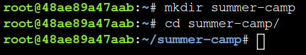
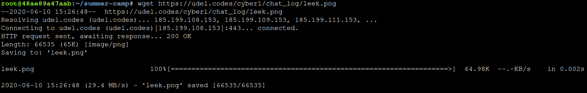
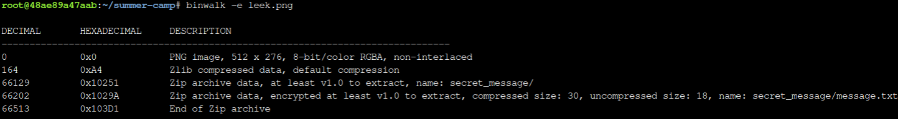
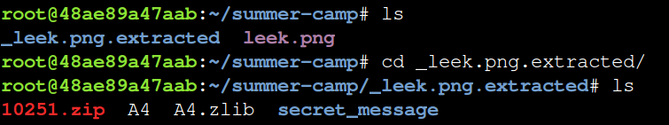
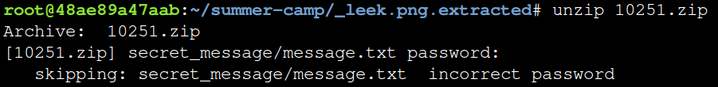
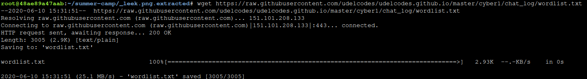
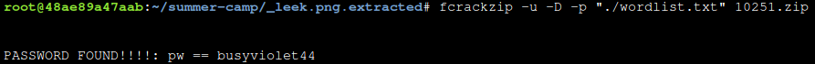
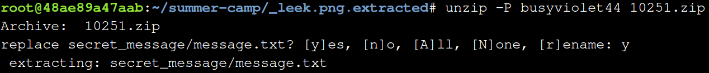
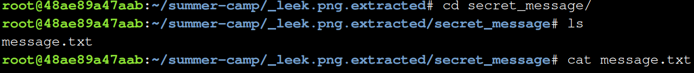

# Steps to extract and bruteforce a zip file

Go to the web terminal [here](https://cslabs.app/).

## Login to CSLabs

 - Sign into CyberSecLabs using a valid email address or a google account.
 - Once signed in, on the top left select the LESSONS tab
 - Select the "term" lesson to access the terminal for today.

After you type a command, remember to press the *enter* key on your keyboard to run it. 

To keep your files neat, make a new directory using the *mkdir* command. 
```
mkdir summer-camp
```

*Change directories* into the directory you just made using *cd.*
```
cd summer-camp
```


 
Grab the image you want to try to extract a zip file from using the *wget* command and the link to your image on the web. 
```
wget https://udel.codes/cyber1/chat_log/leek.png
```


Use *binwalk* on your image. Binwalk takes a look at all of the 0's and 1's that make up your image and it tries to figure out if there are any hidden files inside. 

Be sure to include the *file extension* along with the name of your image. Your image might have a .jpg, .gif, or .png extension. 

The *-e* opton tells binwalk to extract the files it finds into a new folder.
```
binwalk -e leek.png
```


Let binwalk run for a bit. You may get some error messages, but for our purposes this is okay. If the program hangs, press enter. 

Once binwalk is done, use *ls* to see the folder that binwalk has extracted any hidden files into. 
```
ls 
```


Now we are going to *change directories* into the folder that binwalk has extracted any hidden files into. 

The folder is going to start with an underscore.  

You can type *cd* followed by the first character that the folder starts with, and then press the *tab* key on your keyboard. The terminal will try to complete the name of the folder for you so that you don't have to type the entire name yourself.  
```
cd _leek.png.extracted
```

Now that you are in the folder with the extracted files, type *ls* to see the extracted files.
```
ls
```


The *.zip* file is the file that contains the secret message. If you try to look inside the *secret_message* folder right now, you will see that there is a message.txt file, however, if you try to view what is inside of message.txt, there will be no message inside. 

Try to unzip the *.zip* file using *unzip*. You will be asked for a password. But you probably don't know the password yet. If you try an incorrect password three times, the program will stop. 
```
unzip 10251.zip 
```


Now we will try to crack the password to the zip file using a *wordlist* and a *python script.* 

We need to use *wget* to get the wordlist file, and the python script file from the internet into our terminal. 

Get the wordlist:
```
wget https://raw.githubusercontent.com/udelcodes/udelcodes.github.io/master/cyber1/chat_log/wordlist.txt
```


Now we will use fcrackzip on the zip file, and tell it to try out every word in our wordlist. 
```
fcrackzip -u -D -p "./wordlist.txt" 10251.zip
```


After you run  fcrackzip, it will tell you if it found the right password to the zip file using your wordlist.

You can now unzip the file using your found password with the following command:
```
unzip -P busyviolet44 10251.zip
```


Now you *cd* into the "secret_message" folder.
```
cd secret_message
```

Type *ls* to see the contents of the folder. 
```
ls
```

You can see what is inside of "message.txt" by using the *cat* command.
```
cat message.txt
```


And you have found the secret message!
